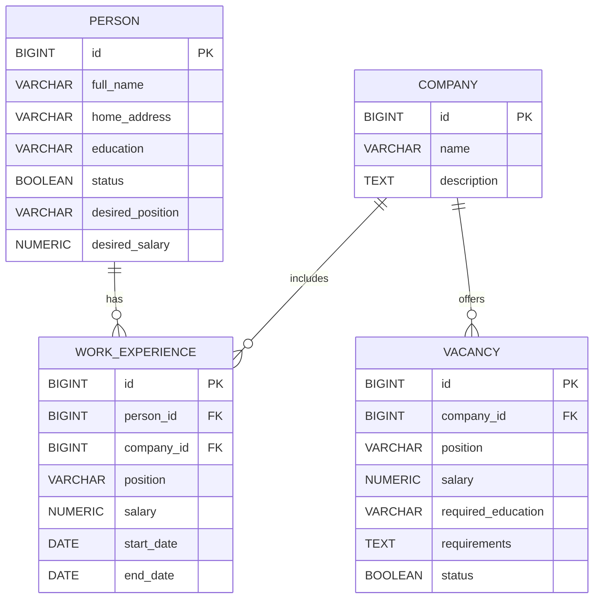

# Кадровое агентство

## 1. Концептуальная модель пользовательского интерфейса

Приложение предназначено для работы сотрудника кадрового агентства с данными о людях, компаниях, вакансиях и истории работы кандидатов.

### Основные сущности интерфейса
- Люди и резюме.
- История работы человека.
- Компании.
- Вакансии.
- Результаты подбора.

### Основные разделы приложения
- **Главная страница** — точки входа в основные разделы системы.
- **Раздел "Люди"** — просмотр, поиск, фильтрация и редактирование данных о людях и их истории работы.
- **Раздел "Компании"** — просмотр, поиск, фильтрация и редактирование компаний и вакансий.
- **Раздел "Результаты подбора"** — отображение подходящих вакансий для человека или подходящих резюме для вакансии.

### Общая логика интерфейса
- Основная работа ведется через списки и карточки сущностей.
- Создание и редактирование выполняются через отдельные формы.
- Поиск и фильтрация встроены в страницы списков.
- Взаимный подбор выполняется из карточки человека или карточки вакансии.
- Все операции должны быть доступны через понятные переходы между страницами.

---

## 2. Перечень сценариев использования

### Люди и резюме
- 01 Просмотреть список людей.
- 02 Открыть карточку человека.
- 03 Добавить нового человека.
- 04 Отредактировать данные человека.
- 05 Удалить человека.
- 06 Просмотреть историю работы человека.
- 07 Добавить запись в историю работы.
- 08 Отредактировать запись о месте работы.
- 09 Удалить запись из истории работы.

### Компании и вакансии
- 10 Просмотреть список компаний.
- 11 Открыть карточку компании.
- 12 Добавить новую компанию.
- 13 Отредактировать данные компании.
- 14 Удалить компанию.
- 15 Просмотреть список вакансий компании.
- 16 Добавить вакансию в компанию.
- 17 Отредактировать вакансию.
- 18 Удалить вакансию.
- 19 Просмотреть подробности вакансии.
- 20 Закрыть вакансию без удаления.
- 21 Переоткрыть ранее закрытую вакансию.
- 22 Показывать в поиске только активные вакансии.

### Поиск и фильтрация
- 23 Найти резюме по образованию.
- 24 Найти резюме по зарплате.
- 25 Найти резюме по компаниям, в которых человек работал.
- 26 Найти резюме по должностям, которые человек занимал.
- 27 Найти вакансии по компании.
- 28 Найти вакансии по должности.
- 29 Найти вакансии по зарплате.
- 30 Применить несколько фильтров к списку резюме.
- 31 Применить несколько фильтров к списку вакансий.
- 32 Отсортировать результаты по зарплате.
- 33 Скрывать из подбора людей, которые сейчас не ищут работу.
- 34 Скрывать закрытые вакансии.
- 35 Найти подходящие вакансии для выбранного человека.
- 36 Найти подходящие резюме для выбранной вакансии.
- 37 Отсортировать список совпадений.

### Проверки корректности
- 38 Проверить обязательные поля вакансии.
- 39 Проверить обязательные поля человека.
- 40 Проверить отсутствие пересечений дат в истории работы.

---

## 3. Перечень страниц приложения

- P-01. Главная страница
- P-02. Список людей
- P-03. Карточка человека
- P-04. Форма редактирования человека
- P-05. Форма редактирования информации о работе
- P-06. Список компаний
- P-07. Карточка компании
- P-08. Форма редактирования компании
- P-09. Карточка вакансии
- P-10. Форма редактирования вакансии
- P-11. Результаты подбора

---

## 4. Описание сценариев использования

### Люди и резюме

#### 01. Просмотреть список людей
**Страницы:** P-01 "Главная страница" → P-02 "Список людей"

**Шаги пользователя:**
1. На главной странице открыть раздел "Люди".
2. Перейти на страницу списка людей.
3. Просмотреть таблицу людей и доступные фильтры.

#### 02. Открыть карточку человека
**Страницы:** P-02 "Список людей" → P-03 "Карточка человека"

**Шаги пользователя:**
1. Открыть страницу списка людей.
2. Выбрать нужного человека в таблице.
3. Перейти в карточку выбранного человека.

#### 03. Добавить нового человека
**Страницы:** P-02 "Список людей" → P-04 "Форма редактирования человека"

**Шаги пользователя:**
1. На странице списка людей нажать "Добавить человека".
2. Заполнить поля формы.
3. Сохранить данные и вернуться к списку или карточке.

#### 04. Отредактировать данные человека
**Страницы:** P-03 "Карточка человека" → P-04 "Форма редактирования человека"

**Шаги пользователя:**
1. Открыть карточку человека.
2. Нажать "Редактировать".
3. Изменить данные в форме.
4. Сохранить изменения.

#### 05. Удалить человека
**Страницы:** P-03 "Карточка человека"

**Шаги пользователя:**
1. Открыть карточку человека.
2. Нажать "Удалить".
3. Подтвердить удаление записи.

#### 06. Просмотреть историю работы человека
**Страницы:** P-03 "Карточка человека"

**Шаги пользователя:**
1. Открыть карточку человека.
2. Перейти к блоку истории работы.
3. Просмотреть записи о компаниях, должностях и зарплатах.

#### 07. Добавить запись в историю работы
**Страницы:** P-03 "Карточка человека" → P-05 "Форма редактирования информации о работе"

**Шаги пользователя:**
1. В карточке человека нажать "Добавить запись".
2. Указать компанию, должность, зарплату и даты.
3. Сохранить новую запись и вернуться в карточку человека.

#### 08. Отредактировать запись о месте работы
**Страницы:** P-03 "Карточка человека" → P-05 "Форма редактирования информации о работе"

**Шаги пользователя:**
1. Открыть нужную запись в истории работы.
2. Изменить компанию, должность, зарплату или даты.
3. Сохранить изменения.

#### 09. Удалить запись из истории работы
**Страницы:** P-03 "Карточка человека" → P-05 "Форма редактирования информации о работе"

**Шаги пользователя:**
1. Открыть запись в истории работы.
2. Нажать "Удалить".
3. Подтвердить удаление и вернуться в карточку человека.

### Компании и вакансии

#### 10. Просмотреть список компаний
**Страницы:** P-01 "Главная страница" → P-06 "Список компаний"

**Шаги пользователя:**
1. На главной странице открыть раздел "Компании".
2. Перейти на страницу списка компаний.
3. Просмотреть таблицу компаний и доступные фильтры.

#### 11. Открыть карточку компании
**Страницы:** P-06 "Список компаний" → P-07 "Карточка компании"

**Шаги пользователя:**
1. Открыть список компаний.
2. Выбрать компанию в таблице.
3. Перейти в карточку выбранной компании.

#### 12. Добавить новую компанию
**Страницы:** P-06 "Список компаний" → P-08 "Форма редактирования компании"

**Шаги пользователя:**
1. На странице списка компаний нажать "Добавить компанию".
2. Заполнить название и описание.
3. Сохранить данные компании.

#### 13. Отредактировать данные компании
**Страницы:** P-07 "Карточка компании" → P-08 "Форма редактирования компании"

**Шаги пользователя:**
1. Открыть карточку компании.
2. Нажать "Редактировать".
3. Изменить данные компании.
4. Сохранить изменения.

#### 14. Удалить компанию
**Страницы:** P-07 "Карточка компании"

**Шаги пользователя:**
1. Открыть карточку компании.
2. Нажать "Удалить".
3. Если у компании нет записей в истории работы, подтвердить удаление.
4. Если записи есть, получить сообщение об ограничении и оставить компанию в системе.

#### 15. Просмотреть список вакансий компании
**Страницы:** P-07 "Карточка компании"

**Шаги пользователя:**
1. Открыть карточку компании.
2. Перейти к таблице вакансий.
3. Просмотреть открытые и закрытые вакансии компании.

#### 16. Добавить вакансию в компанию
**Страницы:** P-07 "Карточка компании" → P-10 "Форма редактирования вакансии"

**Шаги пользователя:**
1. В карточке компании нажать "Добавить вакансию".
2. Заполнить должность, зарплату и требования.
3. Сохранить вакансию.

#### 17. Отредактировать вакансию
**Страницы:** P-09 "Карточка вакансии" → P-10 "Форма редактирования вакансии"

**Шаги пользователя:**
1. Открыть карточку вакансии.
2. Нажать "Редактировать".
3. Изменить данные вакансии.
4. Сохранить изменения.

#### 18. Удалить вакансию
**Страницы:** P-09 "Карточка вакансии"

**Шаги пользователя:**
1. Открыть карточку вакансии.
2. Нажать "Удалить".
3. Подтвердить удаление вакансии.

#### 19. Просмотреть подробности вакансии
**Страницы:** P-07 "Карточка компании" → P-09 "Карточка вакансии"

**Шаги пользователя:**
1. Открыть карточку компании.
2. Выбрать вакансию в таблице вакансий.
3. Перейти в карточку вакансии.

#### 20. Закрыть вакансию без удаления
**Страницы:** P-09 "Карточка вакансии"

**Шаги пользователя:**
1. Открыть карточку вакансии.
2. Нажать "Закрыть вакансию".
3. Убедиться, что статус вакансии изменился на закрытый.

#### 21. Переоткрыть ранее закрытую вакансию
**Страницы:** P-09 "Карточка вакансии"

**Шаги пользователя:**
1. Открыть карточку закрытой вакансии.
2. Нажать "Переоткрыть вакансию".
3. Убедиться, что вакансия снова стала активной.

#### 22. Показывать в поиске только активные вакансии
**Страницы:** P-06 "Список компаний" / P-11 "Результаты подбора"

**Шаги пользователя:**
1. Открыть список компаний или результаты подбора.
2. Включить фильтр "Только активные вакансии".
3. Просмотреть список без закрытых вакансий.

### Поиск и фильтрация

#### 23. Найти резюме по образованию
**Страницы:** P-02 "Список людей"

**Шаги пользователя:**
1. Открыть страницу списка людей.
2. Выбрать значение фильтра по образованию.
3. Применить фильтр и просмотреть подходящие резюме.

#### 24. Найти резюме по зарплате
**Страницы:** P-02 "Список людей"

**Шаги пользователя:**
1. Открыть страницу списка людей.
2. Указать фильтр по желаемой минимальной зарплате.
3. Применить фильтр и просмотреть результаты.

#### 25. Найти резюме по компаниям, в которых человек работал
**Страницы:** P-02 "Список людей"

**Шаги пользователя:**
1. Открыть страницу списка людей.
2. Выбрать компанию в фильтре по истории работы.
3. Применить фильтр, использующий данные `work_experience`.
4. Просмотреть только тех людей, у которых есть запись о работе в выбранной компании.

#### 26. Найти резюме по должностям, которые человек занимал
**Страницы:** P-02 "Список людей"

**Шаги пользователя:**
1. Открыть страницу списка людей.
2. Выбрать должность в фильтре по истории работы.
3. Применить фильтр, использующий данные `work_experience.position`.
4. Просмотреть только тех людей, которые занимали выбранную должность.

#### 27. Найти вакансии по компании
**Страницы:** P-06 "Список компаний" / P-07 "Карточка компании"

**Шаги пользователя:**
1. Открыть список компаний.
2. Найти компанию по названию или перейти в ее карточку.
3. Просмотреть вакансии выбранной компании.

#### 28. Найти вакансии по должности
**Страницы:** P-06 "Список компаний" / P-07 "Карточка компании" / P-09 "Карточка вакансии"

**Шаги пользователя:**
1. Открыть страницу со списком или карточкой вакансий.
2. Указать фильтр по должности.
3. Просмотреть вакансии с выбранной должностью.

#### 29. Найти вакансии по зарплате
**Страницы:** P-06 "Список компаний" / P-07 "Карточка компании"

**Шаги пользователя:**
1. Открыть список компаний или карточку компании.
2. Указать фильтр по предлагаемой зарплате.
3. Просмотреть подходящие вакансии.

#### 30. Применить несколько фильтров к списку резюме
**Страницы:** P-02 "Список людей"

**Шаги пользователя:**
1. Открыть страницу списка людей.
2. Одновременно задать фильтры по образованию, зарплате, статусу, прошлой компании и прошлой должности.
3. Применить фильтры.
4. Просмотреть сокращенный список резюме.

#### 31. Применить несколько фильтров к списку вакансий
**Страницы:** P-06 "Список компаний" / P-07 "Карточка компании"

**Шаги пользователя:**
1. Открыть список компаний или карточку компании.
2. Одновременно задать фильтры по названию, активности, должности и зарплате.
3. Применить фильтры и просмотреть результат.

#### 32. Отсортировать результаты по зарплате
**Страницы:** P-02 "Список людей" / P-11 "Результаты подбора"

**Шаги пользователя:**
1. Открыть список людей или результаты подбора.
2. Выбрать сортировку по зарплате.
3. Просмотреть список в новом порядке.

#### 33. Скрывать из подбора людей, которые не ищут работу
**Страницы:** P-11 "Результаты подбора"

**Шаги пользователя:**
1. Открыть результаты подбора резюме.
2. Включить фильтр скрытия людей, которые не ищут работу.
3. Просмотреть отфильтрованный список кандидатов.

#### 34. Скрывать закрытые вакансии
**Страницы:** P-11 "Результаты подбора" / P-06 "Список компаний"

**Шаги пользователя:**
1. Открыть результаты подбора или список компаний.
2. Включить фильтр скрытия закрытых вакансий.
3. Просмотреть список только с активными вакансиями.

#### 35. Найти подходящие вакансии для выбранного человека
**Страницы:** P-03 "Карточка человека" → P-11 "Результаты подбора"

**Шаги пользователя:**
1. Открыть карточку человека.
2. Нажать "Подобрать вакансии".
3. Перейти на страницу результатов подбора.
4. Просмотреть список подходящих вакансий.

#### 36. Найти подходящие резюме для выбранной вакансии
**Страницы:** P-09 "Карточка вакансии" → P-11 "Результаты подбора"

**Шаги пользователя:**
1. Открыть карточку вакансии.
2. Нажать "Поиск резюме".
3. Перейти на страницу результатов подбора.
4. Просмотреть список подходящих кандидатов.

#### 37. Отсортировать список совпадений
**Страницы:** P-11 "Результаты подбора"

**Шаги пользователя:**
1. Открыть результаты подбора.
2. Выбрать способ сортировки совпадений.
3. Просмотреть обновленный порядок элементов списка.

### Проверки корректности

#### 38. Проверить обязательные поля вакансии
**Страницы:** P-10 "Форма редактирования вакансии"

**Шаги системы:**
1. Пользователь заполняет форму вакансии и нажимает "Сохранить".
2. Система проверяет наличие компании, должности и зарплаты.
3. Если обязательное поле не заполнено, сохранение блокируется и выводится сообщение об ошибке.

#### 39. Проверить обязательные поля человека
**Страницы:** P-04 "Форма редактирования человека"

**Шаги системы:**
1. Пользователь заполняет форму человека и нажимает "Сохранить".
2. Система проверяет наличие ФИО, образования и статуса.
3. Если обязательное поле не заполнено, сохранение блокируется и выводится сообщение об ошибке.

#### 40. Проверить отсутствие пересечений дат в истории работы
**Страницы:** P-05 "Форма редактирования информации о работе"

**Шаги системы:**
1. Пользователь вводит данные новой или измененной записи о работе.
2. Система сравнивает интервал дат с другими записями того же человека.
3. Если интервалы пересекаются, сохранение блокируется и показывается сообщение об ошибке.

---

## 5. Описание страниц приложения

### P-01. Главная страница
**Содержимое:**
- Краткая сводка по приложению.
- Ссылки на разделы "Люди" и "Компании".

**Действия:**
- Перейти к списку людей.
- Перейти к списку компаний.

---

### P-02. Список людей
**Содержимое:**
- Таблица людей.
- Поля таблицы: ФИО, образование, статус поиска работы, желаемая должность, минимальная зарплата.
- Фильтры по образованию, зарплате, статусу, компании из истории работы и должности из истории работы.
- Сортировка по зарплате.
- Кнопка добавления человека.

**Действия:**
- Открыть карточку человека.
- Добавить нового человека.
- Применить фильтры по образованию, зарплате и статусу.
- Применить фильтры по компании из истории работы и по ранее занимаемой должности.
- Отсортировать список.

---

### P-03. Карточка человека
**Содержимое:**
- Полные данные человека.
- Блок условий желаемой работы.
- Таблица истории работы.
- Кнопка "Редактировать".
- Кнопка "Подобрать вакансии".

**Действия:**
- Открыть форму редактирования человека.
- Удалить человека.
- Открыть форму редактирования записи о работе.
- Добавить запись в историю работы.
- Запустить подбор вакансий.

---

### P-04. Форма редактирования человека
**Содержимое:**
- Поля: ФИО, адрес, образование, статус, желаемая должность, минимальная зарплата.
- Сообщения об ошибках валидации.

**Действия:**
- Сохранить нового человека.
- Сохранить изменения существующего человека.
- Отменить ввод.
- Вернуться в список людей или карточку человека.

---

### P-05. Форма редактирования информации о работе
**Содержимое:**
- Поля: компания, должность, зарплата, дата начала, дата окончания.
- Признак текущего места работы вычисляется по правилу `end_date IS NULL`, отдельного поля в БД для него нет.
- Сообщения об ошибках валидации.
- Проверка отсутствия пересечений дат.

**Действия:**
- Добавить запись.
- Отредактировать запись.
- Закрыть срок работы.
- Удалить запись.
- Вернуться в карточку человека.

---

### P-06. Список компаний
**Содержимое:**
- Таблица компаний.
- Поля таблицы: название компании, число вакансий.
- Фильтры: наличие открытых вакансий, поиск по названию.
- Кнопка добавления компании.

**Действия:**
- Открыть карточку компании.
- Добавить новую компанию.
- Применить фильтры.

---

### P-07. Карточка компании
**Содержимое:**
- Данные компании.
- Таблица вакансий компании.
- Признак состояния вакансии: открыта или закрыта.
- Сообщение о том, что компанию нельзя удалить, если на нее ссылается история работы кандидатов.

**Действия:**
- Открыть форму редактирования компании.
- Открыть карточку вакансии.
- Добавить вакансию.
- Удалить компанию, если у нее нет связанных записей в `work_experience`.

---

### P-08. Форма редактирования компании
**Содержимое:**
- Поля: название компании, описание.

**Действия:**
- Сохранить компанию.
- Отменить изменения.
- Вернуться в карточку компании или список компаний.

---

### P-09. Карточка вакансии
**Содержимое:**
- Должность.
- Зарплата.
- Компания.
- Требования к образованию.
- Требования к послужному списку.
- Статус вакансии.
- Кнопка поиска резюме.

**Действия:**
- Открыть форму редактирования вакансии.
- Удалить вакансию.
- Закрыть вакансию.
- Переоткрыть вакансию.
- Запустить поиск подходящих резюме.

---

### P-10. Форма редактирования вакансии
**Содержимое:**
- Поля: компания, должность, зарплата, требования к образованию, требования к послужному списку.
- Сообщения об ошибках валидации.

**Действия:**
- Создать вакансию.
- Сохранить изменения вакансии.
- Отменить изменения.
- Вернуться в карточку компании или вакансии.

---

### P-11. Результаты подбора
**Содержимое:**
- Список вакансий для выбранного человека или список людей для выбранной вакансии.
- Сортировка результатов.
- Фильтры скрытия неподходящих записей.

**Действия:**
- Открыть карточку вакансии.
- Открыть карточку человека.
- Отсортировать результаты.
- Скрыть людей, не ищущих работу.
- Скрыть закрытые вакансии.

## 6. Схема навигации между страницами

### Текстовая схема переходов
- Главная страница → Список людей
- Главная страница → Список компаний

- Список людей → Карточка человека
- Список людей → Форма редактирования человека

- Карточка человека → Форма редактирования человека
- Карточка человека → Форма редактирования информации о работе
- Карточка человека → Результаты подбора

- Форма редактирования человека → Список людей
- Форма редактирования человека → Карточка человека

- Форма редактирования информации о работе → Карточка человека

- Список компаний → Карточка компании
- Список компаний → Форма редактирования компании

- Карточка компании → Форма редактирования компании
- Карточка компании → Карточка вакансии
- Карточка компании → Форма редактирования вакансии

- Форма редактирования компании → Список компаний
- Форма редактирования компании → Карточка компании

- Карточка вакансии → Форма редактирования вакансии
- Карточка вакансии → Результаты подбора
- Карточка вакансии → Карточка компании

- Форма редактирования вакансии → Карточка вакансии
- Форма редактирования вакансии → Карточка компании

- Результаты подбора → Карточка человека
- Результаты подбора → Карточка вакансии

---

## 7. Проверки корректности данных

### Для человека
- Обязательные поля: ФИО, образование.
- Если обязательные поля не заполнены, сохранение запрещено.

### Для вакансии
- Обязательные поля: компания, должность, зарплата.
- Если обязательные поля не заполнены, сохранение запрещено.

### Для истории работы
- Новая или измененная запись не должна пересекаться по датам с другими записями того же человека.
- Если пересечение дат обнаружено, сохранение запрещено и пользователю показывается сообщение об ошибке.

---

## 8. Схема БД

### ER-диаграмма

### Пояснения к полям

| Таблица | Поле | Пояснение |
|---|---|---|
| `person` | `status` | Признак поиска работы: `TRUE` означает, что человек ищет работу, `FALSE` — не ищет. Поле обязательное и не допускает `NULL`. |
| `person` | `desired_position` | Желаемая должность, на которую человек претендует при активном поиске работы. |
| `person` | `desired_salary` | Желаемая минимальная зарплата, с которой человек готов рассматривать предложения. |
| `vacancy` | `status` | Состояние вакансии: `TRUE` означает, что вакансия открыта, `FALSE` — закрыта. |
| `vacancy` | `requirements` | Требования к послужному списку и опыту работы кандидата для данной вакансии. |
| `work_experience` | `end_date` | Дата окончания работы; значение `NULL` означает, что это текущее место работы. |

---

## 9. Отображение данных БД на страницы пользовательского интерфейса

| Таблица БД | Поля | Страницы и блоки |
|---|---|---|
| `person` | `full_name`, `education`, `status`, `desired_position`, `desired_salary` | P-02 "Список людей", P-03 "Карточка человека", P-04 "Форма редактирования человека", P-11 "Результаты подбора" |
| `person` | `home_address` | P-03 "Карточка человека", P-04 "Форма редактирования человека" |
| `work_experience` | `company_id`, `position`, `salary`, `start_date`, `end_date` | P-02 "Список людей" (фильтры по прошлой компании и прошлой должности), P-03 "Таблица истории работы", P-05 "Форма редактирования информации о работе", P-11 "Результаты подбора" |
| `company` | `name`, `description` | P-06 "Список компаний", P-07 "Карточка компании", P-08 "Форма редактирования компании", P-09 "Карточка вакансии" |
| `vacancy` | `company_id`, `position`, `salary`, `required_education`, `requirements`, `status` | P-07 "Таблица вакансий компании", P-09 "Карточка вакансии", P-10 "Форма редактирования вакансии", P-11 "Результаты подбора" |
